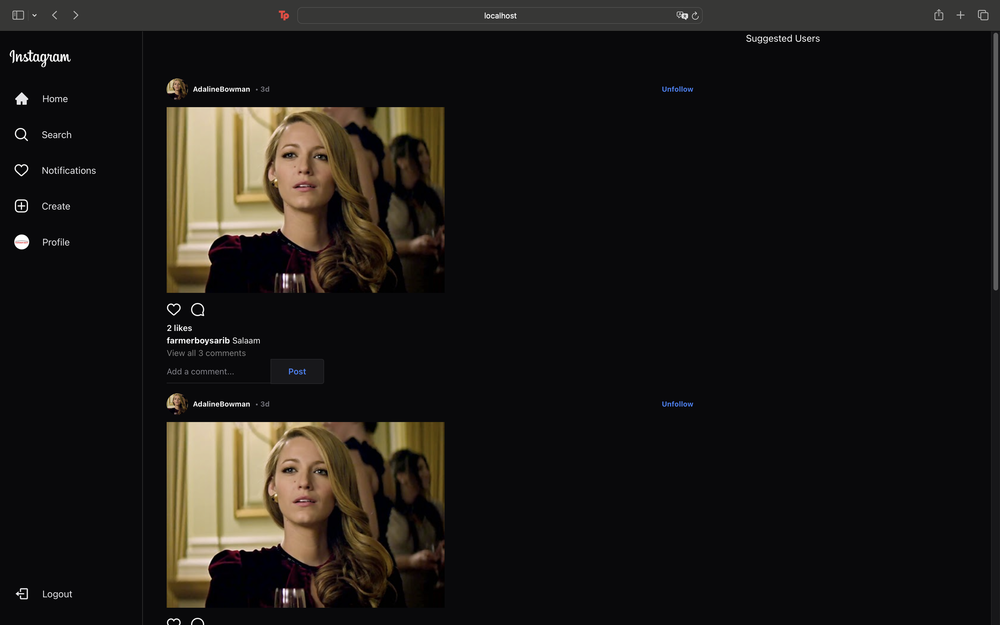
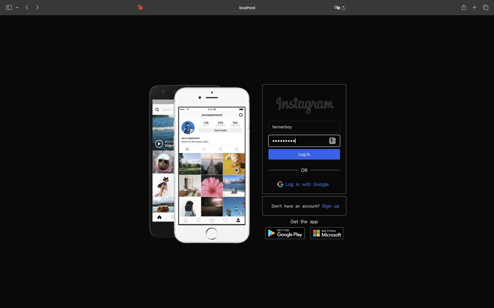

# Instagram Clone

A simple Instagram-inspired web app built with React, Vite, Chakra UI, and React Router. So far only some front end work has been done including auth page, signup, login, logout, and some components of main page.

---

## 🚀 Screenshots

### 🏠 Home Page
This is the default landing page


### 🔐 Auth Page
Can be accessed using /auth, and also by pressing the logout button on the landing page


### Sign-up Page

---

## 🛠️ Tech Stack

- React
- Vite
- Chakra UI
- React Router DOM

---

## 📦 Setup

```bash
git clone https://github.com/your-username/instagram-clone.git
cd instagram-clone
npm install
npm run dev
